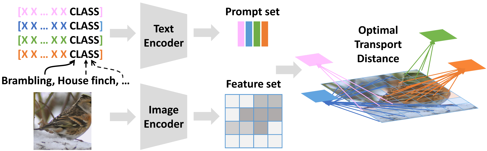

# PLOT: Prompt Learning with Optimal Transport for Vision-Language Models
Created by [Guangyi Chen](https://chengy12.github.io/), [Weiran Yao](https://weirayao.github.io/), [Xiangchen Song](https://xiangchensong.github.io/), Xinyue Li, [Yongming Rao](https://raoyongming.github.io/), [Kun Zhang](https://www.andrew.cmu.edu/user/kunz1/)

This repository contains PyTorch implementation for ICLR2023 spotlight paper __PLOT：Prompt Learning with Optimal Transport for Vision-Language Models__ [[arXiv]](https://arxiv.org/abs/2210.01253)

PLOT is a method to jointly learn multiple comprehensive prompts to describe diverse characteristics of categories such as intrinsic attributes or extrinsic contexts. To solve the degradation problem of multiple prompts, we introduce optimal transport to match the multiple local patterns of vision and text modalities. Specifically, we first model images and the categories with visual and textual feature sets. Then, we apply a two-stage optimization strategy to learn the prompts. In the inner loop, we optimize the optimal transport distance to align visual features and prompts by the Sinkhorn algorithm, while in the outer loop, we learn the prompts by this distance from the supervised data.



## Updates

- **May 2023**:We release a brief script for the [visulization](visualization.py).

- **April 2023**: PLOT can further benifit from the initilization of ChatGPT and obtain the average 1 shot performance on 11 datasets as 71.7!  Code will come soon!

- **March 2023**: PLOT can support the VIT-B/16 backbone now and obtain the average 1 shot performance on 11 datasets as 70.6!  Please refer to [PLOT++](plot-pp/) for details.


## PLOT for Prompt Learning  

See [PLOT-CoOp](plot-coop/).


## PLOT for Adapter-based Methods

See [PLOT-Adapter](plot-adapter/).

## PLOT for Multi-modal Prompt Learning

See [PLOT-PP](plot-pp/).

## License
MIT License

## Citation
If you find our work useful in your research, please consider citing:
```
@inproceedings{chen2023plot,
  title={Prompt Learning with Optimal Transport for Vision-Language Models},
  author={Chen, Guangyi and Yao, Weiran and Song, Xiangchen and Li, Xinyue and Rao, Yongming and Zhang, Kun}
  booktitle={ICLR},
  year={2023}
}
```
